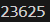
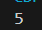
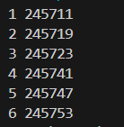

# Лабораторная работа №6
## Вариант 3
## Задача 1
Андрей составляет 6-буквенные коды из букв А, Н, Д, Р, Е, Й. Буква Й может использоваться в коде не более одного раза, при этом она не может стоять на первом месте, на последнем месте и рядом с буквой Е. Все остальные буквы могут встречаться произвольное количество раз или не встречаться совсем. Сколько различных кодов может составить Андрей?  
### Код  
```
from itertools import *
l = ['А', 'Н', 'Д', 'Р', 'Е', 'Й']
def f(x):
    if x[0] == 'Й': return False
    if x[-1] == 'Й': 
        return False
    if x.count('Й') > 1: 
        return False
    s = ''.join(x)
    if s.count('ЕЙ') + s.count('ЙЕ') == 0:
        return True
n = product(l, repeat=6)
fl = []
for x in n:
    if f(x)==True:
        fl.append(x)
n = len(fl)
print(n)
```
**Вывод:** 

## Задача 2  
Сколько единиц содержится в двоичной записи значения выражения  $8^{2020} + 4^{2017} + 26 - 1$?  
### Код
```
n = 8**2020+4**2017+26-1
n = bin(n)
print(n.count('1'))
```  
**Вывод:**  

## Задача 3
Найдите среди целых чисел, принадлежащих числовому отрезку 
$[245690;245756]$ простые числа. Выведите на экран все найденные простые числа в порядке возрастания, слева от каждого числа выведите его порядковый номер в последовательности. Каждая пара чисел должна быть выведена в отдельной строке. Например, в диапазоне $[5; 9]$ ровно два различных натуральных простых числа  — это числа 5 и 7, поэтому для этого диапазона вывод на экран должен содержать следующие значения:
1 5
3 7

### Код
```
# Функция для проверки, является ли число простым
def f(x):
    if x < 2:
        return False
    if x==2:
        return True
    if x%2==0:
        return False
    for i in range(2, int(x**0.5)+1, 2):
        if x % i == 0:
            return False
    return True
# Диапазон чисел
start = 245690
end = 245756

# Нахождение и вывод простых чисел с их порядковыми номерами
count = 0
for num in range(start, end + 1):
    if f(num):
        count += 1
        print(count, num)
```
**Вывод:** 